  

## Tech Stack
Technologies:
Programming languages:
Tools:
Frameworks:

## GitHub Stat Cards

## Contact Info
LinkedIn:
Personal Blog/Website: WIP
Email (Professional):

## Projects to Check out
Descriptions + Repo Cards to be added

## Achievements + Certifications
2x Hackathon Winner, Published a Paper in JSPG, Ceritifications from GWC & Udacity (to be added for convenience later)

#### Open to Internships, Co-ops, & Fellowships | Building things that matter

<!--
About Me: Name, What I Do, Main Areas of Interest/Expertise in Tech
Key Projects: Provide a short description for each, what technologies were used, and the problem it solves. Include links to the repositories or live sites if available.
Extracurriculars, Hobbies and/or Interests that highlight leadership: (2x Hackathon Winner, Pubished a Paper)
Awards, Achievements or Certifications: List any notable recognition artifacts that could bolster your credibility and showcase your commitment to your professional development., leetcode, hackerrank
(on personal website, add ai assistant)

  

  

## 🛠 Tech Stack

  

-->
