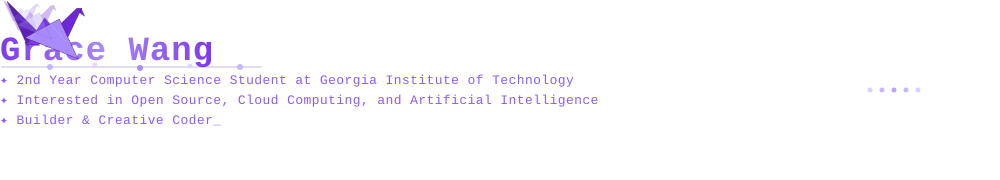

  

<h3 align="center"> Currently Working On: Audio to Sheet Music Converter
<h3 align="center"> Currently Learning: 
  
 

<h2 align="center"> Where to Reach Me: </h2>

  
  
  <!-- 
  
  -->

<h2 align="center"> Tech Stack </h2>
<table width="100%">
  <tr>
    <td align="center" valign="top" width="25%">
      <b>Languages</b> 
        
      
       
    </td>
    <td align="center" valign="top" width="25%">
      <b>Frameworks</b>     
   
    </td>
    <td align="center" valign="top" width="25%">
        <b>Tools</b>  
   
    </td>
    <td align="center" valign="top" width="25%">
      <b>Technologies</b>  
      
    </td>
  </tr>
</table>

<!-- Personal Blog/Website: WIP
 -->

<h2 align="center"> Achievements & Certifications</h2>

 2x Hackathon Winner 
 Published a Policy Memo in the Journal of Science Policy & Governance — <a href="https://orcid.org/0009-0005-1772-7569">check it out here</a> 
 Certifications from  & 

#### Open to Internships, Co-ops, & Fellowships | Building Things That Matter

<!--
About Me: Name, What I Do, Main Areas of Interest/Expertise in Tech
Key Projects: Provide a short description for each, what technologies were used, and the problem it solves. Include links to the repositories or live sites if available.
Extracurriculars, Hobbies and/or Interests that highlight leadership: (2x Hackathon Winner, Pubished a Paper)
Awards, Achievements or Certifications: List any notable recognition artifacts that could bolster your credibility and showcase your commitment to your professional development., future ideas: leetcode, hackerrank
(on personal website, add ai assistant)
-->
